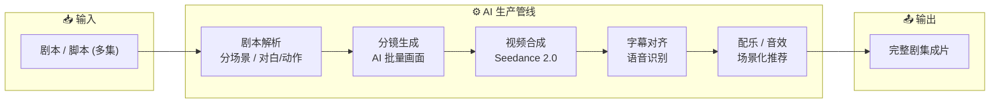

# 🎬 Moyin Manju Improved · AI 影视生产工具（改良版）

> **⚠️ 本仓库为第三方改良版，非原创**——系在原项目基础之上进行的二次开发、Bug 修复与功能增强。

<p align="center">
  <a href="https://github.com/wangwenlin333/moyin-manju-improved">
    
  </a>
  <a href="https://github.com/wangwenlin333/moyin-manju-improved">
    
  </a>
  <a href="https://github.com/wangwenlin333/moyin-manju-improved/releases">
    
  </a>
  <a href="https://github.com/wangwenlin333/moyin-manju-improved/releases">
    
  </a>
  <a href="https://github.com/wangwenlin333/moyin-manju-improved/issues">
    
  </a>
</p>

<p align="center">
  
  
  
  
  
</p>

> **AI 影视工业级生产管线**：从剧本到成片的全流程批量化，支持 Seedance 2.0，一键完成分镜生成、视频合成、字幕对齐、配乐选择，极大缩短 AI 短剧 / 漫剧的制作周期。

---

## 🖥️ 下载安装

前往 **Releases** 页面下载桌面安装包（Windows / macOS / Linux）：

[](https://github.com/wangwenlin333/moyin-manju-improved/releases)

> 本项目为 Electron 桌面应用，支持本机下载安装；也可 `npm run dev` 本地开发运行。

---

## 📐 处理管线



---

## 🛠️ 改良版做了什么

| 类别 | 说明 |
| --- | --- |
| 🐞 Bug 修复 | 修复分镜生成失败、长视频合成中断、字幕时间轴偏移等问题 |
| 🎨 体验优化 | 重构 UI 交互，增加批量预览、进度可视化、错误日志面板 |
| ⚙️ 工程化 | 完善构建脚本，优化打包体积与崩溃恢复 |
| 🔧 扩展配置 | 新增模型 Provider 切换、自定义 Prompt 模板、输出目录策略 |

> 详细改动见仓库 CHANGELOG 与 `docs/WORKFLOW_GUIDE.md`。

---

## 🚀 开发运行

```bash
npm install
npm run dev      # 开发模式
npm run build    # 构建 Electron 桌面端
npm run dist     # 打包发布
```

---

## 📁 目录结构

```
moyin-manju-improved/
├─ src/               # 主进程 / 渲染进程源码
├─ build/             # 应用图标、资源
├─ scripts/           # 构建与清理脚本
├─ docs/              # 工作流指南、示例剧本
├─ LICENSE
└─ package.json
```

---

## 📜 说明

- **非原创**：本仓库基于公开开源项目进行改良，遵循原项目（AGPL-3.0）许可证。
- **商用合规**：如需商用，请同时遵守上游许可证与所调用 AI 服务的 ToS。
- 改良仅代表对本地工程的维护，不替代原项目官方版本。